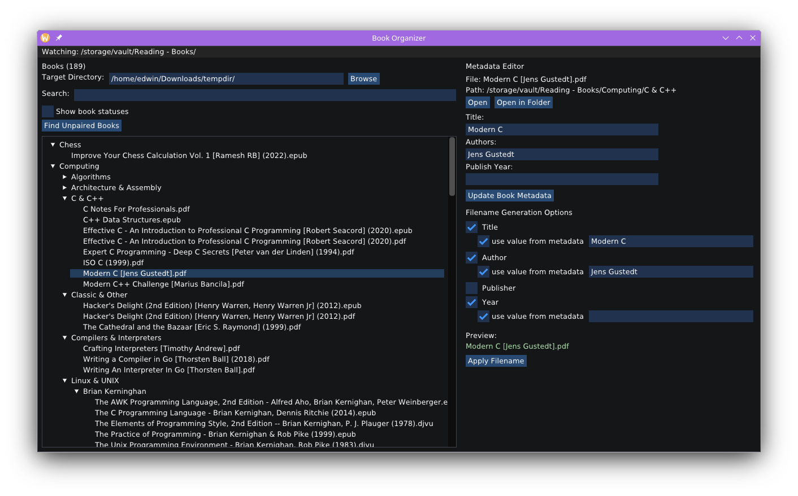

# Book Organizer

An ImGUI C++ application for managing and syncing eBooks and PDFs.

It's all vibe-coded so use at your own risk. I'll work on fixing some of the worst code later.



## Features

- **Recursive Directory Monitoring**: Continuously watches a directory for book files
- **Real-time File Detection**: Automatically detects new and modified book files
- **Metadata Editing**: Edit title, author, and publication year
- **Smart File Naming**: Automatically renames files based on metadata in the format: `[title] [author] (year).extension`
- **Supported Formats**: PDF, EPUB, MOBI, AZW, AZW3, TXT, DOC, DOCX, FB2, DJVU, CBR, CBZ

## Setup

```bash
git clone git@github.com:hyperupcall-experiments/book-organizer
cd ./book-organizer
conan install --build=missing .
cmake -S . -B ./build -DCMAKE_TOOLCHAIN_FILE=build/Release/generators/conan_toolchain.cmake -DCMAKE_BUILD_TYPE=Release
conan --build ./build
./build/BookOrganizer '/source directory' '/target directory'
```
